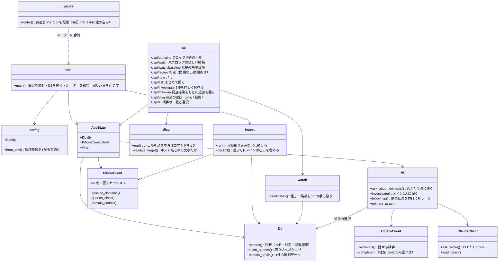
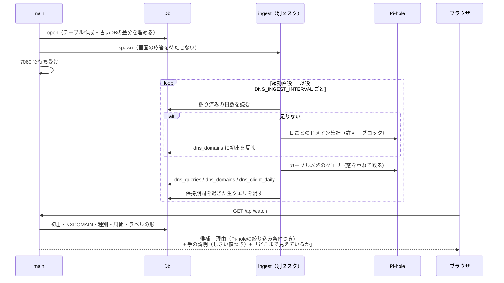
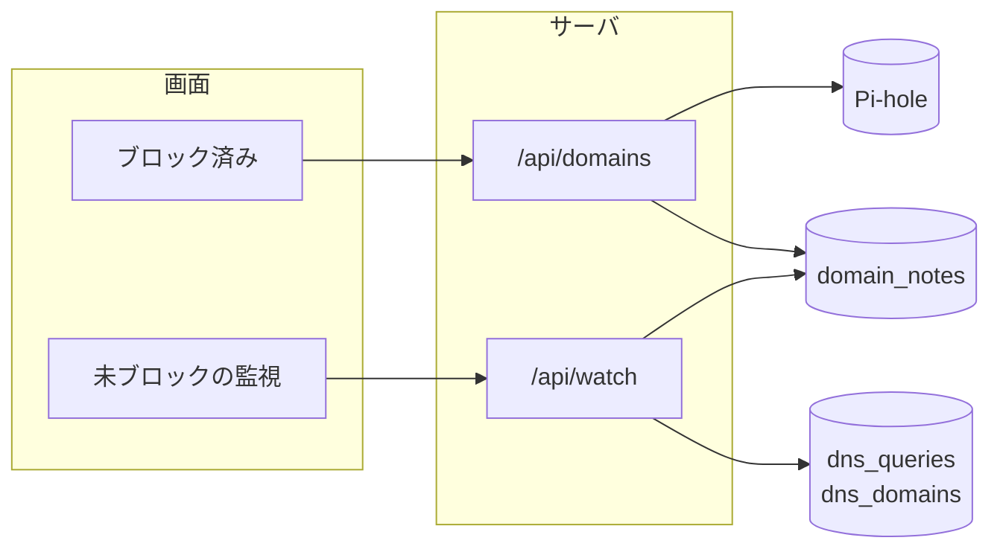
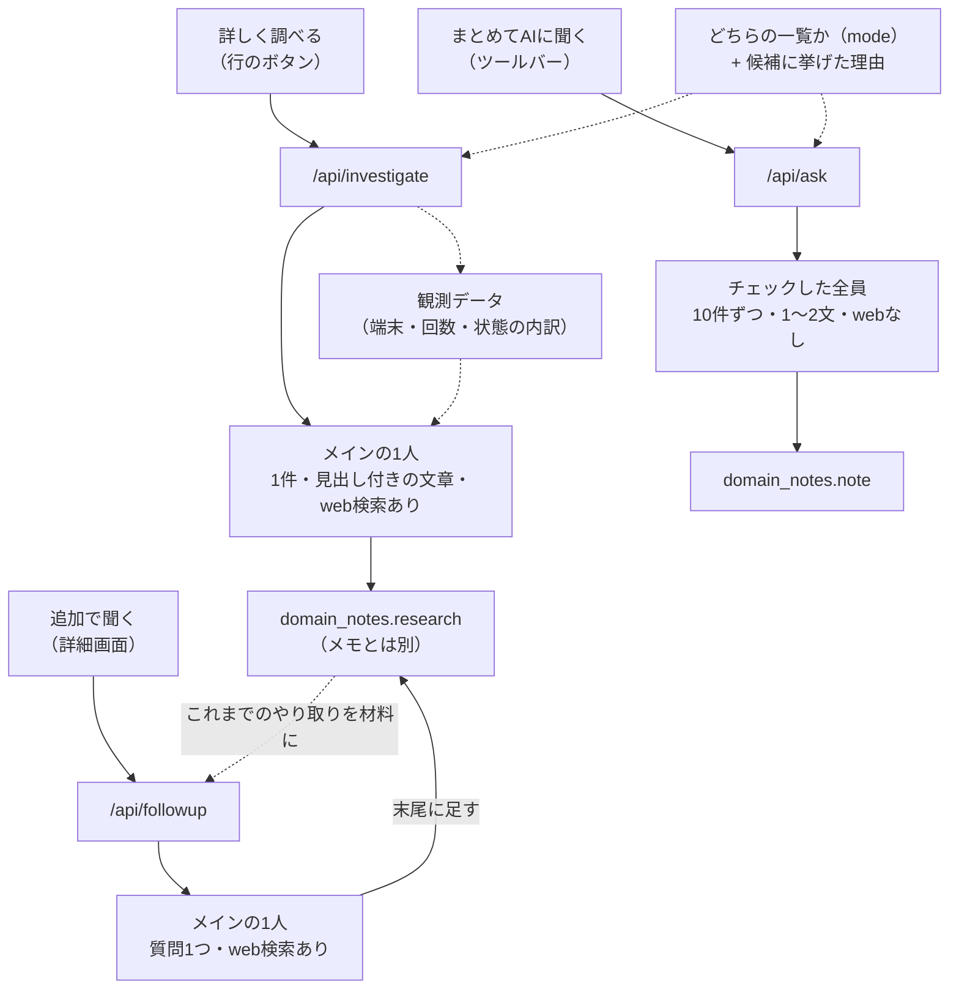
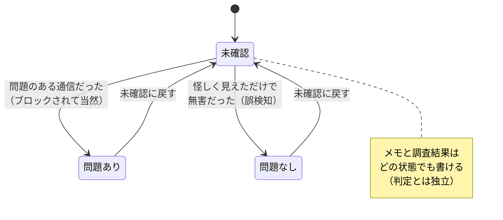
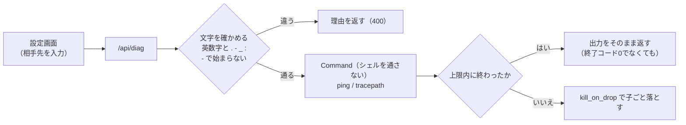

# 構成図

モジュールの関係と、処理の流れを図にした文書。**コードを読む前に「どこに何があるか」を
掴むため**に置いている。各モジュールの中の決めごとは [`CLAUDE.md`](../CLAUDE.md) にある。

## モジュールの関係

**外部に出ていくのは `PiholeClient` / `ChiezoClient` / `ClaudeClient` の3つだけ。**
ブラウザは Pi-hole も Chiezo も直接は見ない（`/api/*` だけを叩く）——
Pi-hole のパスワードをブラウザに配らないため。

## 起動してから

理由に付いてくる絞り込み条件は、そのまま Pi-hole の管理画面
（`/admin/queries.lp?domain=…&client_ip=…&from=…&until=…`）へのリンクになる ——
**「本当にそうなっているか」は元の通信を見るのが一番早い**。

## 2つの一覧

**材料も判定も違うので、口を分けてある。**

- **ブロック済み**は Pi-hole をその場で叩いた集計（貯めたものは使わない）
- **未ブロックの監視**は貯めた過去との突き合わせ（Pi-hole は叩かない）
- どちらも `domain_notes` を重ねるので、**メモ・判定・調査結果は両方の一覧で共有される**

## 2つの聞き方

**「詳しく調べる」に観測データを渡すのが要点。** そのドメインが何かは web でも分かるが、
**このネットワークでどう振る舞っているか**はこちらしか知らない。両方を突き合わせて初めて
「放っておいてよいか」が言える。

**「追加で聞く」は「詳しく調べる」の続き。** 相手（メインの1人）も材料（観測データ・web検索）も
上限秒数も同じで、違うのは**これまでのやり取りと質問を渡し、答えを `research` の末尾に足す**
ところ。次の質問にはその全文を渡すので会話が続く —— 別々に持つと、2つ目の質問が
1つ目の答えを知らないまま返ってくる。

**どちらの一覧から聞いたか（`mode`）も渡す。** ブロック済みの一覧は「Pi-hole が止めたもの」
なので「なぜ止まったか」を聞けばよいが、監視の一覧は**ブロックの結果ではなく振る舞いで
拾った候補**で、同じ文言で聞くと「ブロックされたと考えられます」という嘘のメモが並ぶ
（実際にそうなっていた）。監視のときは**候補に挙げた理由（観測した事実）も一緒に渡す**
—— 「はじめて見た」のと「10分おきに鳴っている」のとでは、書くべきことが違う。

## 判定の流れ

**測っているのは「そのドメイン自身が問題のある通信か」**であって、「人が対処すべきか」ではない。
一覧に並ぶものは「ブロックが妥当だったもの」と「怪しく見えただけのもの」の混ざりもので、
**「確認済み」の一語に畳むと、何が誤検知だったのかが分からなくなる**。

## 疎通の確認だけ、外へパケットを出す

一覧の判定はすべて「Pi-hole が記録したもの」の突き合わせで、**このアプリが自分で
パケットを出すのは設定画面の ping / 経路だけ**（`diag.rs`）。外部コマンドを呼ぶのも
ここ1か所なので、守りもここに閉じている。

## 更新の手順

図はコードに追従させる。**モジュールを足した・口を足した・状態を増やしたときは、
同じコミットでこの文書も直す**（DBの形を変えたときは [`database.md`](database.md) も）。
