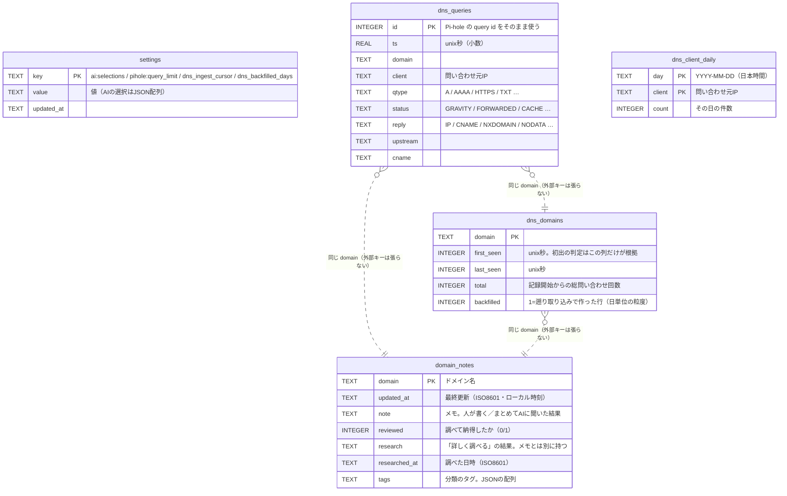

# データベース定義

SQLite（`$DATA_DIR/monitor.db`）のテーブル定義と、テーブル間の関係をまとめた文書。
**マイグレーションをたどらなくても最終形が分かるようにするため**に置いている。

定義の**権威は2か所**にあり、この文書はそれを読める形に写したもの:

| 何 | どこ |
|---|---|
| `CREATE TABLE` そのもの | [`Db::open`](../src/db.rs)（起動のたびに `IF NOT EXISTS` で当てる） |
| 古いDBを今の形に合わせる差分 | [`migrate`](../src/db.rs)（列の有無を見てから `ALTER TABLE`） |

**DBに変更を入れたら、同じコミットでこの文書も更新する**（手順は末尾）。

## 全体像

**2つの島に分かれていて、島の間に外部キーは無い。** 片方は人（とAI）が付けた判断、
もう片方は観測した事実で、消える速さも消し方も違う。

## 2つの島

| | 判断の島 | 観測の島 |
|---|---|---|
| テーブル | `domain_notes` | `dns_queries` / `dns_domains` / `dns_client_daily` |
| 中身 | 人とAIが付けた判定・メモ・調査結果 | Pi-hole から取り込んだ事実 |
| 消えるか | **消えない**（人が消すまで） | `dns_queries` だけ保持期間で消える |
| 書く人 | 画面の操作・`/api/ask`・`/api/investigate` | `ingest.rs`（定期取り込み） |

**外部キーを張っていない。** ドメイン名で緩くつながっているだけで、それぞれ独立に
増減する ——「メモはあるが直近の観測は無い」「観測はあるがメモは無い」のどちらも普通の状態で、
参照整合性を課すと片方を消すたびにもう片方を巻き込むことになる。

## テーブルごとの決めごと

### `domain_notes` — 人とAIが付けた判断

- **`note` と `reviewed` は独立している。** 行があること = 確認済み だった頃は、
  メモを残すために確認済みにするしかなかった ——「まだ判断していないが調べた内容は
  残したい」（まとめてAIに聞いた結果がまさにそれ）が表せなかった
- **状態は `reviewed` の1つだけ。** かつては `verdict`（`issue` 問題あり / `ok` 問題なし）を
  併せ持っていたが、**見返すときに要るのは「もう見たか」だけ**だったのでやめた。
  列は移行で落としてある（`ALTER TABLE ... DROP COLUMN`）—— 読まなくなった列を残すと、
  次にこのテーブルを読む人が「どちらが本当の状態か」を確かめることになる
- **`research` はメモと別に持つ。** メモは人が書く（あるいは「一括AIメモ生成」が書く）もので、
  「詳しく調べる」の結果で黙って上書きすると**書いた判断が消える**。画面では詳細のメモの上に、
  別の見た目で出す
- **追加の質問と答えは `research` の末尾に足す**（`append_research`）。列を増やさないのは、
  1つ目の答えとその続きが離れると読めないため。**次の質問にはこの全文を渡す**ので、
  やり取りが続く（分けて持つと、2つ目の質問が1つ目の答えを知らないまま返る）。
  **「詳しく調べる」を押し直すと入れ替わる**（`save_research`）—— 調べ直しなので、
  それまでの質問も一緒に流れる
- **`tags` もメモと別に持つ。** 発生元のアプリまで分かったドメインに名前を付けて、後から
  まとめて見るための列。メモは文章で、タグは絞り込みの鍵 —— 文章に埋めると同じアプリを
  同じ表記で書き続けることになり、揃わない。形はJSONの配列（`["YouTube","広告"]`）。
  区切り文字で繋がないのは、名前に区切りが混ざったときに壊れるため（`settings` の
  `AiChoice` と同じ理由）。読み書きの両方で `normalize_tags` を通す
  （空白落とし・重複除去・1つ40文字・1件20個まで）
- **何も持たない行は消す**（`cleanup`）。未確認 + メモ空 + 調査結果空 + タグ無し の行が対象。
  残しても害は無いが、設定のページの「メモが残っているドメイン」（`/api/notes` が
  この表を全件返す）に中身の無い行が並ぶ。
  **調査結果が入っている行は消さない**（30秒かけて調べた結果を捨てない）

### `dns_queries` — 生のクエリ（保持期間つき）

- **主キーは Pi-hole の `id` をそのまま使う。** 取りこぼさないよう取得の窓を重ねるので、
  重複を弾く手立てが要る
- **Pi-hole のDBが作り直されると `id` が振り直される。** そのままだと新しい行が
  「見たことのある `id`」として弾かれ続け、静かに取り込みが止まる。届いた `id` が手元の最大より
  小さければ、この表を空にして取り直す（`dns_domains` は残す）
- 索引は `ts` と `(domain, ts)`。前者は保持期間の掃除と窓の絞り込み、後者は
  1ドメインの時系列（周期の検出・観測データの組み立て）
- **ブロック済みの一覧もここを読む**（`domain_activity_since`）。Pi-hole の集計は
  ドメインと件数しか返さないので、**アクセス元（端末）と通信が起きていた期間**はこの表から出す。
  **見るのは直近24時間だけ**（監視の候補と同じ窓。2つの一覧を並べて読むので、窓が違うと
  同じ端末の見え方が食い違う）。
  数えるのは `status` がブロックを表す行だけ（`GRAVITY%` / `DENYLIST%` / `REGEX%` /
  `EXTERNAL_BLOCKED%` / `SPECIAL_DOMAIN`。**同じ条件で「そのうち止められたぶん」も数えていて**、
  監視の一覧が「Pi-holeが止めている」の印を出すのに使う）—— 同じドメインが通ったり止まったりする
  （端末ごとの設定・CNAME 経由）ので、素通りしたぶんを混ぜると
  「ブロックされた通信の期間」ではなくなる

### `dns_domains` — ドメインの一生（消さない）

- **保持期間を過ぎても消さない。** 初出の判定はこの表だけが根拠で、
  生のクエリと一緒に消すと「毎日すべてが初出」になる
- `first_seen` は**小さいほうを残す**（遡り取り込みが入れた日付を、後から来た新しい時刻で
  上書きしない）
- `backfilled = 1` の行は**日単位の粒度**しか持たない（集計の口から作ったため、時刻が無い）

### `dns_client_daily` — 端末ごとの日次件数（消さない）

- **生のクエリが消えても残す。**「この端末が急に見えなくなった（VPN・DoHに切り替わった）」を
  言うには、保持期間より長い並びが要る
- **設定のページの「アクセス元（端末別）」がこの表を読む**（`/api/clients`）。
  一覧は「どのドメインか」で並んでいるので、**どの端末が喋っているかはここでしか見られない**
  （ルーター経由に化けている割合の推移もここで追う）
- `day` は**日本時間**の日付。UTCで数えると日本の朝9時までが前日に入る

### `settings` — 画面から決める設定

キーと意味:

| キー | 中身 |
|---|---|
| `ai:selections` | 聞く相手の配列（JSON）。`primary` が「詳しく調べる」の担当 |
| `ai:selection` | 単一選択だった頃の値。**読むだけ**（見つけたら配列側へ移して消す） |
| `pihole:query_limit` | Pi-holeから取り込むブロック済みクエリの件数。`-1` で全件（既定）。**かつては `PIHOLE_QUERY_LIMIT` 環境変数だった** |
| `watch:baseline` | 監視の基準日時（unix秒）。**この日時より後だけを見る**。未設定なら直近24時間 |
| `dns_ingest_cursor` | 取り込み済みの最新時刻（unix秒） |
| `dns_backfilled_days` | 遡り取り込みを終えた日数 |

**環境変数ではなくDBに持つ。** 実行のたびに読むので、コンテナを作り直さなくても切り替えが効く。

## 横断的な決めごと

- **Pi-hole には一切書かない。** このDBが持つのは「こちらが付けた判断」と「取り込んだ写し」だけで、
  Pi-hole 側の設定・ブロックリストは触らない
- **日時の持ち方が2通りある。** `domain_notes` と `settings` は人が読む前提の ISO8601 文字列、
  `dns_*` は計算に使う unix 秒（`ts` は小数）。**混ぜないこと**
- **マイグレーション機構は持たない。** 個人運用なので、起動時に `migrate` が差分を埋める。
  **どの手順も「もう済んでいるか」を見てから実行する**ので、何度起動しても同じ結果になる

## 変更手順

1. `Db::open` の `CREATE TABLE` を今の形に直す（新規環境はこれだけで正しく作られる）
2. `migrate` に「列があるか見てから `ALTER TABLE`」を足す（既存のDBを壊さない）
   - 既存行に入れる値を決めること。**列の意味を先に確定させてから決める** ——
     かつての `verdict` は「確認して納得した = 問題なし」と読んで既存の確認済みを `ok` に
     倒したが、正しい意味は「ドメイン自身が問題のある通信か」で、それなら広告・トラッカーの
     類は `issue` にあたった。**意味が固まらない列は足さない**（この列は結局やめた）
   - **やめる列は落とす**（`ALTER TABLE ... DROP COLUMN`）。読まなくなった列を残すと、
     次に読む人が「どちらが本当の状態か」を確かめることになる
3. `DomainRecord` など読み書きする型に列を足す
4. **この文書を同じコミットで更新する**
